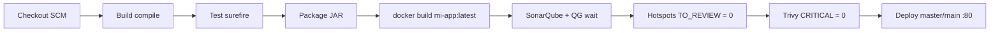

# CICD-DEMO

This project aims to be the basic skeleton to apply continuous integration and continuous delivery.

## Declarative Jenkins pipeline (course exercise)

The root **`Jenkinsfile`** defines a declarative pipeline intended for **Pipeline script from SCM** in Jenkins (GitHub/GitLab/Bitbucket). It separates **Checkout**, **Build**, **Test**, **Docker Build**, **SonarQube** analysis (with Quality Gate wait), an explicit **Security Hotspots** gate, **Trivy** scanning for **CRITICAL** CVEs, and **Deploy** on `main` or `master` using `docker run -d -p 80:80` against image **`mi-app:latest`**.

The previous Kubernetes-focused pipeline (shared library `util.*`, registry, kube credentials) is preserved as **`Jenkinsfile.legacy-kubernetes`** if you still need that reference.

### Flow (high level)



### Jenkins configuration checklist

1. **New Item → Pipeline** (or Multibranch Pipeline). Under **Pipeline**, choose **Pipeline script from SCM**, pick Git, set your repository URL and branch, and **Script Path**: `Jenkinsfile`.
2. **Tools / agents**: Linux agent with **Docker**, **Maven** (optional if you rely only on `./mvnw`), **JDK 11+**, **`python3` or `python`** (for the hotspots helper script), and [**Trivy**](https://aquasecurity.github.io/trivy/latest/getting-started/installation/) on `PATH`.
3. **Credential** (Secret text), ID **`sonar-token`**: SonarQube user token used by `mvn sonar:sonar` and the hotspots API call.
4. **Parameter `SONAR_HOST_URL`**: Default `http://localhost:9000`. If Jenkins runs inside Docker and SonarQube on the host, try `http://host.docker.internal:9000` (Windows/macOS Docker Desktop) or your LAN URL.
5. **SonarQube project**: First analysis creates the project when using key **`cicd-demo`** (same as `SONAR_PROJECT_KEY` in the `Jenkinsfile`). Configure a **Quality Gate** in SonarQube as needed; the pipeline already waits with `-Dsonar.qualitygate.wait=true` and fails if any **Security Hotspot** remains in **`TO_REVIEW`** (see `jenkins/check-sonar-hotspots.sh`).
6. **Trivy gate**: `trivy image --exit-code 1 --severity CRITICAL` fails the build on CRITICAL findings (adjust base image or policies if you need a green baseline).
7. **Job export**: Use Jenkins **Manage Jenkins → ThinBackup** or **Job Config History**, or copy the job `config.xml`. A template for a Pipeline-from-SCM job is under **`jenkins/cicd-demo-pipeline-job-config.xml`** (replace `YOUR_GIT_REPOSITORY_URL`).

### Local SonarQube (Docker Compose)

```bash
docker compose -f compose.sonar.yml up -d
```

Open `http://localhost:9000`, change the default password, create a token under **My Account → Security**, and store it in Jenkins as **`sonar-token`**.

### Post actions

The pipeline **`post`** block publishes **JUnit** results (when present), echoes cleanup, runs **`cleanWs()`**, and on **`failure`** prints a message you can extend with **email** or **Slack** plugins.

## Topology

CICD Demo uses some kubernetes primitives to deploy:

* Deployment
* Services
* Ingress ( with TLS )

```bash
     internet
        |
   [ Ingress ]
   --|-----|--
   [ Services ]
   --|-----|--
   [   Pods   ]

```

This project includes:

* Spring Boot java app
* Jenkinsfile integration to run pipelines
* Dockerfile containing the base image to run java apps
* Makefile and docker-compose to make the pipeline steps much simpler
* Kubernetes deployment file demonstrating how to deploy this app in a simple Kubernetes cluster

## Legacy Makefile / Travis flows

Some pipelines are configured by **GitHub/Projects**. If you have created a repository in one of these, your project may be built automatically when it includes a Jenkinsfile or other CI metadata.

How to run the app (Makefile targets still apply for local workflows):

```make
make
```

## Testing

Unit tests and integrations tests are separated using [JUnit Categories][].

[JUnit Categories]: https://maven.apache.org/surefire/maven-surefire-plugin/examples/junit.html

### Unit Tests

```java
mvn test -Dgroups=UnitTest
```

Or using Docker:

```bash
make build
```

### Integration Tests

```java
mvn integration-test -Dgroups=IntegrationTests
```

Or using Docker:

```bash
make integrationTest
```

### System Tests

System tests run with Selenium using docker-compose to run a [Selenium standalone container][] with Chrome.

[Selenium standalone container]: https://github.com/SeleniumHQ/docker-selenium

Using Docker:

* If you are running locally, make sure the `$APP_URL` is populated and points to a valid instance of your application. This variable is populated automatically in Jenkins.

```bash
APP_URL=http://dev-cicd-demo-master.anzcd.internal/ make systemTest
```
